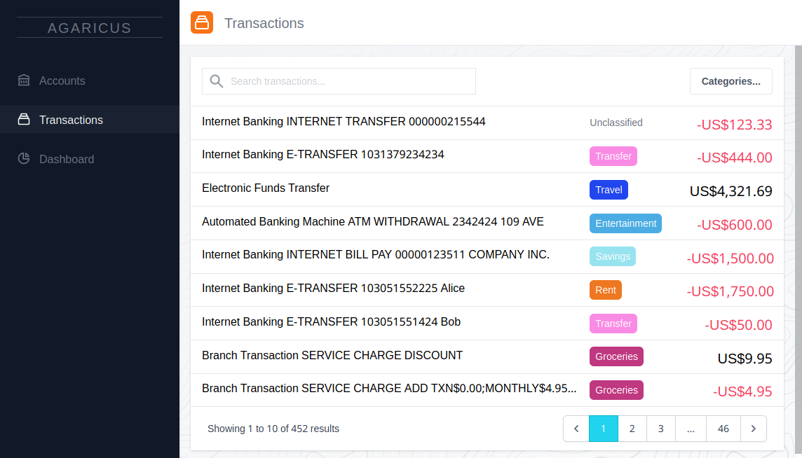
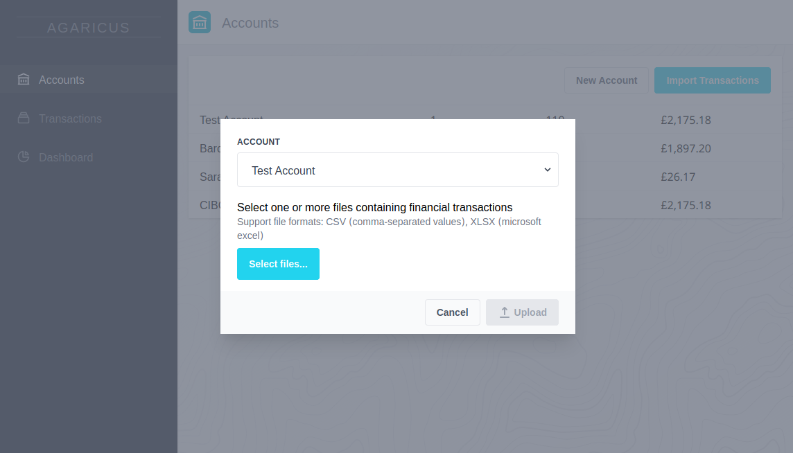

# Agaricus
Work-in-progress personal finance dashboard. Development unlikely to continue.





## Features
* Import financial transactions in CSV or XLSX file
* Heuristics based parser automatically identifies key fields and headers. Easily aggregate multiple sources and formats
* Quickly search and filter transactions, categorize with tags
* Interactive dashboard to gain insights by period and category

## Architecture
Multi-package monorepo managed with [lerna](https://lerna.js.org/)

### Client
* [Hybrids](https://hybrids.js.org/#/) web components framework
* [tailwindcss](https://tailwindcss.com/) utility framework
* [D3.js](https://d3js.org/) for interactive charts

### Server
* ESM Node.js application
* Lightweight REST API with [Fastify](https://www.fastify.io/)
* [Jest](https://jestjs.io/) unit tests (w/Babel for mocking imports)

## Installation


### Docker
```
git clone https://github.com/turnerdev/agaricus
cd agaricus
docker build --no-cache -t agaricus .
docker run -p 8800:8000 -d agaricus
```
